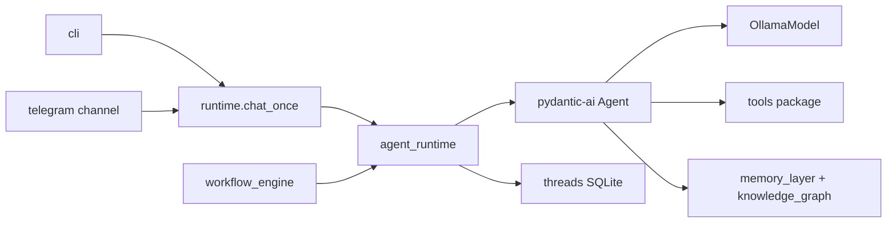

# Best Buddy Agent Architecture (v0.2 — pydantic-ai)

## Agent runtime

- **`agent_runtime.py`**: `build_agent()`, `run_turn()`, `resume_turn()`, `BestBuddyDeps`
- **`agent_trace.py` / `trace_logging.py`**: Local copy-paste trace blocks (`agent-trace.log`)
- **`memory_recall.py`**: single memory recall path (inject + `search_memory` tool)
- **`orchestrator.py`**: thin delegate to `run_turn()` (backward compatible)
- **`approval.py`**: `InterruptResult`, `cli_approval_resolver`, `fixed_approval_resolver`
- **`channels/telegram.py`**: long-polling Telegram bot → `chat_once` / `resume_turn` (see [TELEGRAM.md](TELEGRAM.md))

## Tools (`tools/`)

| Tool | HITL |
|------|------|
| `read_file`, `list_files` | no |
| `search_memory`, `save_memory`, `list_memories`, `get_memory` | no |
| `delete_memory`, `write_file` | yes (`requires_approval`) |
| `workflow_run_status`, `trigger_workflow` | no |

## Memory (unchanged graph; see recall note)

**Full workflow docs:**

- [MEMORY_WORKFLOW.md](MEMORY_WORKFLOW.md) — developer guide (read/write/verify)
- [MEMORY_WORKFLOW_AI.md](MEMORY_WORKFLOW_AI.md) — AI coding agent reference

- `knowledge_graph.py`: SQLite + NetworkX + FAISS
- `memory_extraction.py`, `dream_cycle.py`: background curation
- Injected via `@agent.instructions` + memory tools

### Auto-recall pipeline (`memory_recall.recall_memories`)

Same order as Thoth `agent.py` auto-recall (`agent_flow_analysis.md`), plus the
extracted `agent_context` fallback documented in `THOTH_EXTRACTION_MAP.md`:

1. `graph_enhanced_recall(query)` — FAISS seeds + 1-hop graph + keyword merge inside KG
2. `search_entities(query)` — SQL LIKE on subject/description/aliases/tags
3. `list_entities(limit)` — only when 1–2 return nothing (bounded recent rows)

**Embedding gap:** Thoth uses `Qwen/Qwen3-Embedding-0.6B` (`Thoth/documents.py`).
Best Buddy standalone uses `LocalHashEmbedding` (token-hash, English-token overlap).
Semantic step will not match Cyrillic queries to English-stored facts; step 3 is why
name/profile rows still reach the model without regex or per-language patterns.

Optional: install real embeddings later (e.g. optional extra) and rebuild the FAISS index.

## Workflows

- `workflow_engine.py`: typed steps; **prompt** steps use `make_workflow_step_executor()` → `run_turn()`
- `workflow_models.py`: `WorkflowPlan` for NL workflow creation (structured output)
- **approval** steps use workflow-level `approval_resolver` (unchanged)

## Reliability (optional `[reliability]`)

- Summarization near `llm_num_ctx * 0.85`
- `PatchToolCallsCapability`, `StuckLoopDetection` from pydantic-deep when importable

## Dependencies

- **Required:** `pydantic-ai-slim[openai]` (Ollama via OpenAI-compatible client)
- **No** LangChain / LangGraph
