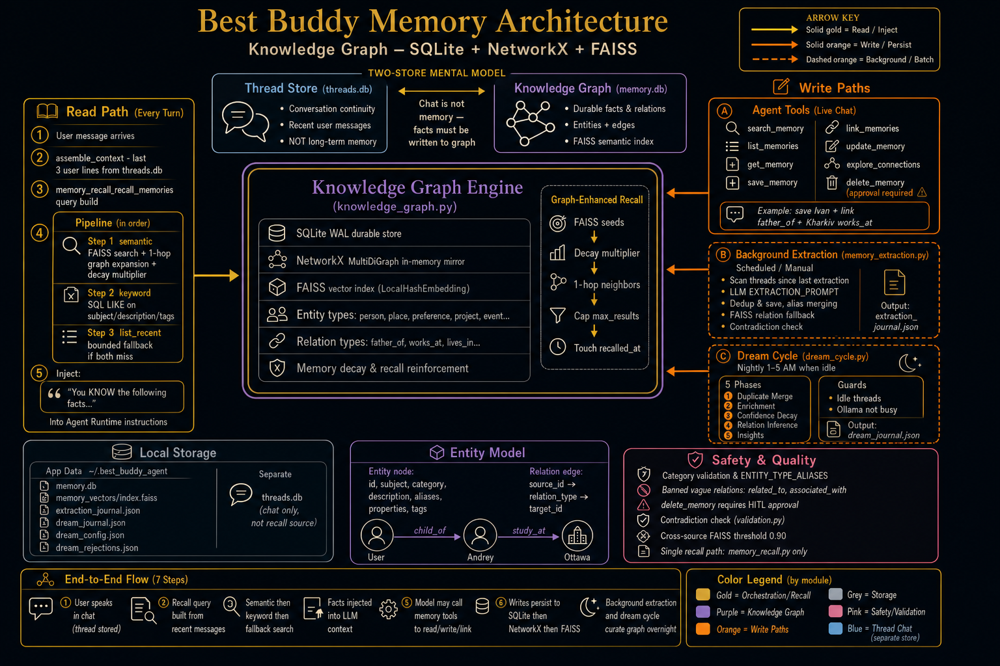
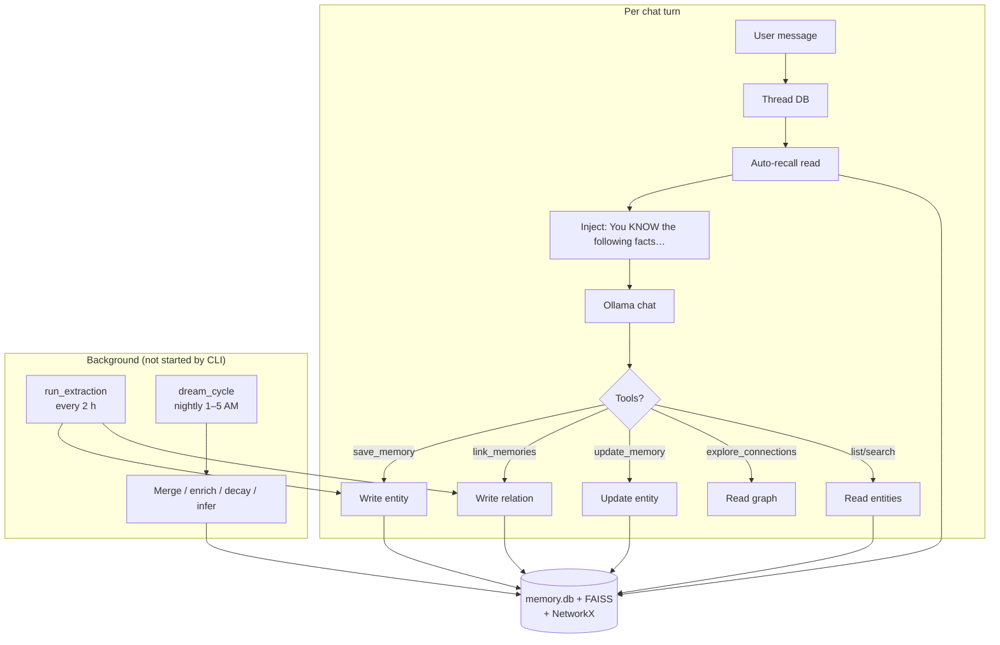

# Memory workflow (developer guide)



Diagram generation prompt (for re-creating or refining the poster): [MEMORY_DIAGRAM_PROMPT.md](MEMORY_DIAGRAM_PROMPT.md).

This document explains how **long-term memory** works in `best_buddy_agent`: what gets stored, when, how it reaches the LLM, and how the graph is maintained over time. Written for **human developers** operating or extending the system.

For coding agents working in this repo, see [MEMORY_WORKFLOW_AI.md](MEMORY_WORKFLOW_AI.md) (dense, path-oriented reference).

---

## Mental model: two stores

| Store | What it is | Used for |
|-------|------------|----------|
| **Thread history** | Chat messages in SQLite (`threads.py`) | Conversation continuity, "what we just said" |
| **Knowledge graph** | Entities + relations in `memory.db` + FAISS (`knowledge_graph.py`) | Durable facts, preferences, people, recall |

**Chat is not memory.** Facts the user shares in conversation stay in the thread until something **writes** them to the graph.



---

## The four ways memory changes

### 1. Auto-recall (read, every turn)

**When:** Before each `run_turn()`, in Python (no extra LLM call).

**What:** Builds a query from the last few user lines + current message, searches the graph, injects matches into the system instructions as:

```text
You KNOW the following facts from long-term memory:
- [id=a1b2c3] [person] Alice: Alice is the user's daughter, born 1998
- [id=d4e5f6] [place] Odessa: City on the Black Sea where the user grew up
```

**Pipeline** (`memory_recall.recall_memories`):

1. `semantic` — FAISS vector search + 1-hop graph expansion
2. `keyword` — SQL `LIKE` on subject/description/tags
3. `list_recent` — bounded `list_entities` if both miss

**Note:** Best Buddy agent uses `LocalHashEmbedding` (not Thoth's Qwen embedding). Non-English queries often hit `list_recent`; see [ARCHITECTURE.md](ARCHITECTURE.md).

---

### 2. Agent tools (read/write during chat)

Registered in `agent_runtime.py`, implemented in `tools/memory_tools.py`, storage via `memory.py` → `knowledge_graph.py`.

| Tool | Effect |
|------|--------|
| `search_memory` | Semantic/keyword recall (same core as inject, formatted for tool output) |
| `list_memories` | List entities; **empty `category`** = all types |
| `get_memory` | Fetch one row by id |
| `save_memory` | Create or merge entity (live, `source=live`) |
| `link_memories` | Create a typed relation between two entities by name |
| `update_memory` | Correct an existing entity's content or metadata |
| `explore_connections` | Show an entity's relations and graph neighbours |
| `delete_memory` | Remove entity (requires approval) |

**Categories (fixed vocabulary, not user-defined):**
`concept`, `event`, `fact`, `media`, `organisation`, `person`, `place`, `preference`, `project`, `self_knowledge`, `skill`

Common model mistakes are **aliased** (e.g. `personal` → `fact`, `preferences` → `preference`, `family` → `person`). Invalid types return a **tool error string** the model reads and retries — not a silent failure.

---

#### `link_memories` — connecting entities

After saving two entities, the model calls `link_memories` to record the relationship between them. This is the primary way the knowledge graph acquires edges during live chat.

**Example conversation:**
```
User: My father's name is Ivan. He worked as an engineer in Kharkiv.

Agent:
  → save_memory(category="person", subject="Ivan", content="User's father, engineer")
  → save_memory(category="place", subject="Kharkiv", content="City in northeastern Ukraine")
  → link_memories(source_id="Ivan", target_id="User", relation_type="father_of")
  → link_memories(source_id="Ivan", target_id="Kharkiv", relation_type="works_at")

"Got it — I've noted that your father Ivan is an engineer and worked in Kharkiv."
```

**Resolution:** `link_memories` resolves entity names by subject (exact/alias match), falling back to hex ID. One 0.5 s retry handles the race where `save_memory` and `link_memories` are called in the same agent turn.

**Banned types:** `related_to`, `associated_with`, `connected_to` and similar vague labels are blocked by `add_relation()`. The model is instructed to always use specific types.

**Common relation types:**

| Relationship | Type | Example |
|---|---|---|
| Family | `father_of`, `mother_of`, `sibling_of`, `child_of`, `spouse_of` | Ivan → User: `father_of` |
| Social | `friend_of`, `colleague_of`, `knows` | |
| Location | `lives_in`, `works_at`, `born_in`, `located_in` | Ivan → Kharkiv: `works_at` |
| Work | `employed_by`, `manages`, `founded`, `works_on` | |
| Interest | `prefers`, `enjoys`, `dislikes`, `interested_in` | |

---

#### `update_memory` — correcting saved facts

When the user corrects a previously saved fact, the model uses `update_memory` with the entity's ID instead of creating a duplicate.

**Example:**
```
User: Actually, Ivan worked in Donetsk, not Kharkiv.

Agent:
  [auto-recall has already injected Ivan's current content]
  → update_memory(memory_id="a1b2c3", content="User's father, engineer, worked in Donetsk")

"Got it — I've updated Ivan's information to show he worked in Donetsk."
```

The `memory_id` comes from the recalled memory block (shown to the model in the instructions as `[id=a1b2c3]`). No new entity is created.

---

#### `explore_connections` — traversing the graph

Used when the user asks how entities connect, or when the agent needs to understand a person's network.

**Example:**
```
User: Tell me what you know about my family connections.

Agent:
  → explore_connections(entity_id="User", hops=2)

Returns:
  User (person)
  Relationships (2):
    --> [child_of] Ivan (id: a1b2c3)
    --> [child_of] Maria (id: d4e5f6)
  Nearby entities within 2 hops: 4
    [1 hop] Ivan (person) ...
    [2 hop] Kharkiv (place) ...

  ```mermaid
  graph LR
    user123["User (person)"] -->|child_of| ivan456["Ivan (person)"]
    ivan456 -->|works_at| kharkiv789["Kharkiv (place)"]
  ```
```

`hops` is capped at 3. A Mermaid diagram is appended when the graph has at least one edge.

---

### 3. Background extraction (write, batch)

**When:** Only if something calls `memory_extraction.run_extraction()`.

**What:** Scans threads updated since `last_extraction`, formats conversation text, runs a separate LLM job (`EXTRACTION_PROMPT`), parses JSON facts, deduplicates, saves entities and relations to the graph, rebuilds FAISS.

**Five quality upgrades (post-Thoth port):**

| Upgrade | What it does |
|---|---|
| **Alias merging** | Extracted `aliases` field is merged into the entity and registered in the resolution map, so a relation saying `source_subject: "Father"` can resolve to an entity stored as `subject: "Dad"` |
| **FAISS relation fallback** | After `find_by_subject` fails for a relation endpoint, tries `semantic_search(name, threshold=0.80)` |
| **Cross-source threshold** | When the FAISS hit is from a different source type (document vs. chat), raises required similarity from 0.80 to 0.90 to prevent incorrect cross-document merges |
| **Vague/low-confidence filter** | Drops `related_to` and similar banned types; drops relations with `confidence < 0.80` |
| **Workflow thread skip** | Skips threads whose ID starts with `wf-` (agent workflow internals, not user facts) |

**CLI usage (manual trigger):**
```bash
BEST_BUDDY_AGENT_DATA_DIR=/path/to/.data \
  .venv/bin/python -c "
from best_buddy_agent.memory_extraction import run_extraction
print(run_extraction())
"
```

**Journal:** `extraction_journal.json` — each entry includes `threads_scanned`, `entities_saved`, `contradictions_blocked`, `low_confidence_skipped`, and a `thread_details` list.

**Note:** The CLI does **not** start a periodic extraction timer. Thoth's `app.py` calls `start_periodic_extraction()`; best-buddy-agent defines `_INTERVAL_S = 2h` in state but has no timer thread.

---

### 4. Dream cycle (curate graph, not "learn from chat")

**When:** Only if `dream_cycle.start_dream_loop()` is running (not started by CLI). Runs nightly between `window_start` (default 1 AM) and `window_end` (5 AM), at most once per day.

**Guard conditions before running:**
- Enabled in config
- Current hour is inside the time window
- Has not already run today (checks `dream_journal.json`)
- No active conversation threads (`_is_idle`)
- Ollama is not busy (`GET /api/ps` returns `num_requests == 0`)

**Five phases:**

#### Phase 1 — Duplicate merge

Finds entity pairs with high semantic similarity and merges them. After merge:
- Descriptions are merged by the LLM
- The duplicate's subject becomes an **alias** on the survivor (critical for oral history: "Bobby" → Bob's alias field)
- All edges from the duplicate are re-pointed to the survivor
- Batch rotation ensures every entity is visited over multiple cycles

**Name guard:** If two entity subjects share no words (e.g. "Alice Engineer" vs. "Bob Plumber"), the similarity threshold rises from 0.93 to 0.98. This prevents merging people who happen to have similar-sounding descriptions.

**Example:** Two separately-imported entries about the same grandfather:
```
Before:
  entity A: subject="Дед", description="Grandpa from Odessa, born 1922"
  entity B: subject="Дедушка", description="Grandfather, worked on ships"

After Phase 1:
  entity A: subject="Дед", aliases="Дедушка",
            description="Grandpa from Odessa, born 1922. Worked on ships."
  entity B: [deleted]
```

#### Phase 2 — Description enrichment

Finds entities with short descriptions (< 80 chars), searches all conversation threads for sentences that mention the entity by name or alias, and asks the LLM to write a richer description.

Three validation checks before writing:
1. **Contamination check**: new description must not mention other entity subjects (prevents "User's dog" facts contaminating the dog's entity)
2. **Groundedness check**: ≥ 40% of key words in the new description must appear in the source excerpts or old description
3. **Length check**: new description must be longer than old

Requires ≥ 2 conversations as evidence before enriching.

#### Phase 3 — Confidence decay

Inferred relations (`source = 'dream_infer'`) older than 90 days have their confidence multiplied by 0.90. Relations whose confidence falls below 0.30 are pruned entirely.

**Journal tracking:** Each decayed/pruned relation is recorded with its old confidence and action taken.

#### Phase 4 — Relation inference

Scans all conversation threads for entity pairs that co-occur but have no edge in the graph. Passes the co-occurrence count and a real conversation excerpt to `DREAM_INFER_PROMPT`. The LLM decides if a specific, factual relationship exists and what type it is.

Quality guards:
- **Hub cap**: no entity appears in more than 3 candidate pairs per cycle
- **Rejection cache**: pairs where the LLM said "no relation" are not re-evaluated for 7 days (`dream_rejections.json`)
- **Tautology guard**: skips pairs where one subject name contains the other ("Japanese" vs. "Japanese Learning")
- **Evidence stored**: inferred relation properties include the conversation excerpt and co-occurrence count

#### Phase 5 — System insights

Collects a snapshot of KG stats, last extraction and dream journal entries, and active workflows, then asks the LLM for actionable insights. Each insight is logged at INFO level and recorded in the dream journal.

**Config:** `dream_config.json` under `BEST_BUDDY_AGENT_DATA_DIR`.

---

## Per-turn sequence (CLI chat)

1. User message → `runtime.chat_once` → `agent_runtime.run_turn`
2. Load thread history from SQLite
3. `_compose_instructions`: auto-recall → append to system prompt
4. Trace: `ROUTING SNAPSHOT`, optional `LLM WIRE REQUEST/RESPONSE`
5. pydantic-ai `agent.run_sync(user_text, message_history=…)`
6. Model may call tools (loop up to `max_tool_iterations`)
7. Final text reply; new messages appended to thread

**Debugging:** [DEBUGGING.md](DEBUGGING.md) — trace blocks, `log_llm_wire` for exact HTTP JSON.

---

## Data on disk

Override with `BEST_BUDDY_AGENT_DATA_DIR` (default `~/.best_buddy_agent`):

| File / dir | Purpose |
|------------|---------|
| `memory.db` | SQLite entities + relations |
| `memory_vectors/` | FAISS index |
| `threads` data | Conversation batches (see `threads.py`) |
| `memory_extraction_state.json` | Last extraction timestamp |
| `extraction_journal.json` | Extraction run log (threads, saved, contradictions blocked) |
| `dream_config.json` | Dream cycle settings (enabled, window, thresholds, batch offset) |
| `dream_journal.json` | Dream cycle run log (merges, enriched, decayed, inferred, insights) |
| `dream_rejections.json` | Inference rejection cache (7-day TTL) |

---

## Verify memory is working

**After `save_memory`:**
1. **Tool trace:** `TOOL CALL save_memory` → `TOOL RESULT` with JSON containing `"id"`.
2. **List:** Ask agent `list_memories` with **no** category.
3. **Recall:** Next turn `ROUTING SNAPSHOT` shows new subjects in `injected_subjects`.
4. **DB:** `get_memory` with the returned id.

**After `link_memories`:**
1. **Tool trace:** `TOOL RESULT` starting with `"Relationship created."` and a Relation ID.
2. **Graph:** `explore_connections(entity_id="Subject")` shows the new edge.
3. **DB:** `kg.get_relations(entity_id)` in a Python shell.

**After `update_memory`:**
1. **Tool trace:** `TOOL RESULT` — JSON of the updated entity.
2. **Recall:** Next turn the injected fact should reflect the new content.

**Red flags:**
- Agent answers from chat context but `list_memories` is empty → nothing was saved.
- `link_memories` result says `"Relation already exists"` → duplicate call; this is OK, not an error.
- `link_memories` raises "Source entity not found" → either the entity wasn't saved yet (add a `save_memory` call first) or the subject name doesn't match exactly.
- `list_memories(category="personal")` — `personal` is aliased to `fact`; still prefer empty category for "everything".
- Inferred facts in recall seem wrong → check `recall_path: list_recent` in trace — FAISS semantic match may be weak for non-English queries.

---

## Prompts and policy

| Artifact | Role |
|----------|------|
| `conf/prompts/{language}/agent_system.txt` | Live agent: when to call all memory tools |
| `conf/prompts/{language}/import_turn.txt` | Scripted import: save entities then link them |
| `conf/prompts/{language}/background/extraction.txt` | Background extraction JSON |
| `conf/prompts/{language}/dream/merge.txt` | Phase 1: merge two descriptions |
| `conf/prompts/{language}/dream/enrich.txt` | Phase 2: enrich thin descriptions |
| `conf/prompts/{language}/dream/infer.txt` | Phase 4: decide if a relation exists |
| `conf/prompts/{language}/dream/insights.txt` | Phase 5: system health analysis |

Set `[prompts] language` in `best_buddy_agent.conf` (e.g. `en`, `ru`). All paths above resolve under `conf/prompts/{language}/`.

---

## Relation to Thoth

Extracted from Thoth; see [THOTH_EXTRACTION_MAP.md](THOTH_EXTRACTION_MAP.md). The main differences after the full port:

| Area | Best Buddy (now) | Thoth (original) |
|---|---|---|
| Live tools | save, link, update, explore, search, list, get, delete | Same |
| Extraction quality | Alias merging, FAISS fallback, cross-source guard | Same origin |
| Dream cycle | Full 5 phases with all guards | Same origin |
| Background start | **Not auto-started by CLI** | Started by `app.py` |
| Embedding | `LocalHashEmbedding` (weak cross-language) | `Qwen3-Embedding-0.6B` |

---

## Related docs

- [ARCHITECTURE.md](ARCHITECTURE.md) — system diagram, embedding note
- [DEBUGGING.md](DEBUGGING.md) — trace file, wire logging
- [MEMORY_WORKFLOW_AI.md](MEMORY_WORKFLOW_AI.md) — agent-oriented reference
- [TESTING.md](TESTING.md) — pytest layout

Tests touching memory: `test_memory_core.py`, `test_memory_context.py`, `test_agent_runtime.py`, `test_memory_tools_graph.py`, `test_extraction_quality.py`, `test_dream_cycle.py`.
