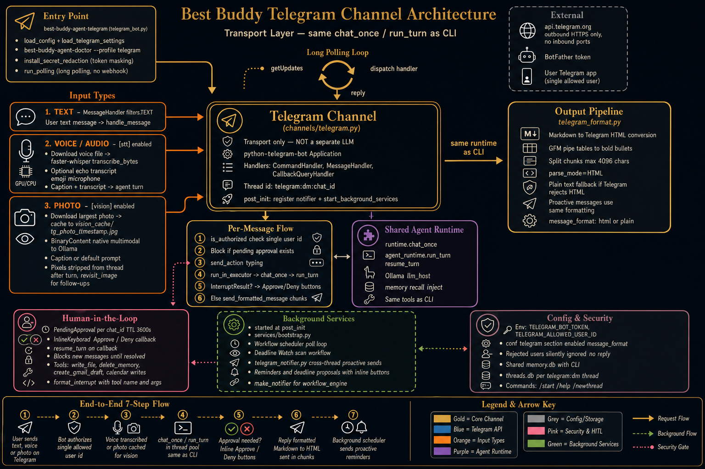

# Telegram channel



Best Buddy can run as a **Telegram bot** (text chat, long polling). The bot is a **transport** — it calls the same `chat_once` / `run_turn` runtime as the CLI, not a separate LLM tool.

## Setup

1. Open [@BotFather](https://t.me/BotFather) on Telegram → `/newbot` → copy the **bot token**.
2. Get your numeric **user id** (e.g. [@userinfobot](https://t.me/userinfobot) or send `/start` to your bot and check logs).
3. Install the Telegram extra:

```bash
pip install -e '.[telegram,stt,faiss,reliability]'
```

4. Set secrets (preferred over putting tokens in the conf file):

```bash
export TELEGRAM_BOT_TOKEN="your-token"
export TELEGRAM_ALLOWED_USER_ID="123456789"
```

Optional in `conf/best_buddy_agent.conf`:

```ini
[telegram]
enabled = true
```

5. Start the bot from the `best-buddy-agent` directory:

```bash
best-buddy-agent-telegram --config conf/best_buddy_agent.conf
```

## Security (MVP)

Only **one** Telegram user id is allowed (`TELEGRAM_ALLOWED_USER_ID`). All other users are ignored (no reply).

The Telegram entrypoint redacts bot tokens in log output (`httpx` URLs are masked; `httpx`/`httpcore` default to WARNING). Prefer env vars over storing `bot_token` in the conf file. If a token was ever pasted into logs or chat, revoke it in [@BotFather](https://t.me/BotFather) and set `TELEGRAM_BOT_TOKEN` to the new value.

## Threads vs memory

| | CLI | Telegram |
|---|-----|----------|
| Conversation history | `cli-main` | `telegram:dm:<chat_id>` |
| Long-term memory | Shared (`~/.best_buddy_agent/memory.db`) | Same |

Use `/newthread` in Telegram to start a fresh chat history; saved facts remain in the knowledge graph.

## Approvals

These tools require human approval (CLI prompt or Telegram **Approve** / **Deny** buttons). New messages are blocked until you respond:

- `write_file`, `delete_memory`
- `create_gmail_draft` (when Gmail is configured)
- `create_calendar_event`, `update_calendar_event` (when Calendar is configured)

## Voice messages (optional)

Enable local transcription in `conf/best_buddy_agent.conf` (see `[stt]` in `best_buddy_agent.conf.example`). Voice notes and audio attachments are transcribed with **faster-whisper** on GPU when `device = auto` and CUDA is available, otherwise CPU.

Production env (systemd `/etc/best-buddy/env`):

```bash
LD_LIBRARY_PATH=/usr/local/lib/ollama/cuda_v12
HF_HOME=/opt/huggingface
HF_HUB_CACHE=/opt/huggingface/cache
```

Models are loaded with `local_files_only=true` (read-only cache; no Hub downloads at runtime). Prefetch `large-v3` into `hf_hub_cache` before enabling STT.

Startup runs a full STT self-test when `[stt] enabled = true` (same as `best-buddy-agent-doctor --profile telegram`).

## Photos (optional, native vision)

Enable in `conf/best_buddy_agent.conf` (see `[vision]` in `best_buddy_agent.conf.example`). Captured **photos** (not documents or albums yet) are downloaded from Telegram and passed to the same agent turn as **text + image** via pydantic-ai `BinaryContent` — the configured Ollama model must list `vision` in its capabilities (`ollama show <model>`).

```ini
[vision]
enabled = true
max_image_bytes = 10485760
```

Use a caption on the photo for your question; without a caption the bot sends a default prompt (`The user sent a photo.`). Trace logs record image size and media type, not raw bytes.

After the first turn, **pixels are removed from thread history**. Only a cache filename remains (default pattern `tg_photo_yyyy_mm_dd_HH_MM_SS.jpg` under `{BEST_BUDDY_AGENT_DATA_DIR}/vision_cache/`, default `~/.best_buddy_agent/vision_cache/`). For follow-up visual questions, the agent calls **`revisit_image`** with that `image_name` to reload the file natively.

```ini
[vision]
enabled = true
file_prefix = tg_photo
```

Startup verifies vision when `[vision] enabled = true` (`best-buddy-agent-doctor --profile telegram`).

## Message formatting

By default (`message_format = html` in `[telegram]`), the bot post-processes agent replies before sending:

- The model can use normal Markdown (`**bold**`, `` `code` ``, fenced blocks, `# headings`, pipe tables).
- GFM pipe tables are rewritten as bold row headings plus `• column: value` bullets (Telegram has no table HTML).
- The channel converts that subset to Telegram HTML and sends with `parse_mode=HTML`.
- Long replies are split on plain-text boundaries first, then each chunk is converted (avoids breaking HTML tags).
- If Telegram rejects a chunk, the same chunk is resent as plain text (tags stripped).

Proactive messages (reminders, deadline proposals) use the same formatting.

Set `message_format = plain` under `[telegram]` to disable conversion (raw text, including visible `**` markers).

No extra prompt rules are required for the model.

## Commands

- `/start` — welcome
- `/help` — short help
- `/newthread` — new conversation thread id

## Troubleshooting

- **Config error: python-telegram-bot** — run `pip install -e '.[telegram]'`.
- **STT startup failed / libcublas** — set `LD_LIBRARY_PATH=/usr/local/lib/ollama/cuda_v12` and install `pip install -e '.[stt]'`.
- **Model not available locally** — prefetch faster-whisper weights into `hf_hub_cache` (see `[stt]` paths in conf).
- **Ollama errors** — the host running the bot must reach `llm_host` in your conf (same as CLI).
- **Trace log** — if `[logging] enabled = true`, use the path printed at startup (`tail -f ...`).

See also [DEBUGGING.md](DEBUGGING.md) and [MEMORY_WORKFLOW.md](MEMORY_WORKFLOW.md).
